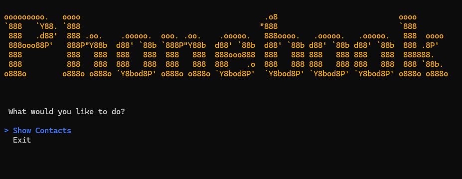

# Phonebook Application

A simple console-based phonebook application built with .NET 10 and Entity Framework Core. This is a project for the [C# Academy](https://www.thecsharpacademy.com/project/16/phonebook).

## Features

- View all contacts with optional filtering by name or phone number
- Basic CRUD with validation
- Error handling
- Data persistence using SQL Server LocalDB

## Prerequisites

- .NET 10 SDK or later
- SQL Server LocalDB (installed with Visual Studio)

## Installation

- Clone the repository `git clone https://github.com/diegopetrola/CodeReviews.Console.Flashcards` and go to it's folder
- Install packages, on Visual Studio packet manager `Restore`
- Add migrations and create the database `Add-Migration InitialMigration` and `Update-Database`
- Run the project `dotnet run`

### Configuring the Connection String

The database connection string is defined in `appsettings.json`:

No changes are required if you're using the default LocalDB instance.

## Built With

- .NET 10
- Entity Framework Core
- SQL Server LocalDB
- Spectre.Console
